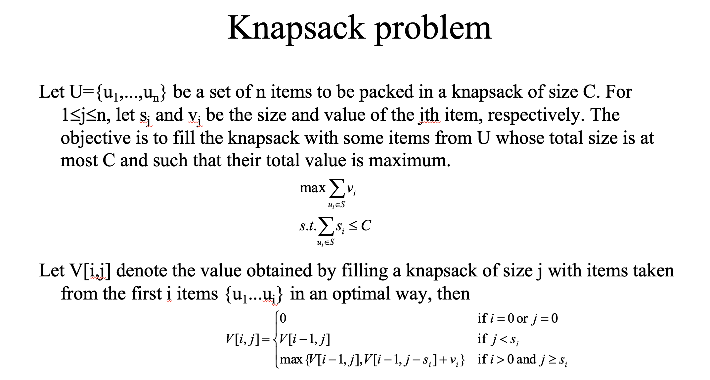

# 动态规划

动态规划适合解决具有[重叠子问题]性质的问题，一般来讲能用动态规划求解的问题都可以使用暴力搜索等方法求解，可以使用动态规划中的DPtable记住一些状态，进而把时间复杂度从指数级别降低到N^2级别。使用动态规划，通过使用DPtable记录已经求解过的子问题的解，每一个子问题只会被计算一次。

最优子结构性质：一个问题的最优解包含子问题的最优解。举例来说，若一个问题P的最优解为S，那么S的子集Sk也是P的某个子问题Pk的最优解。如果确定一道题目要用动态规划来解决，可以设定一个最优解，然后分析它与可能的子问题之间的关系，进而得到状态转移方程。

动态规划中最优子结构就是状态转移方程。解决动态规划的题目可以先从回溯，dfs等暴力算法入手，然后再用dpTable，然后再推导出状态转移方程来用DP。很多比较难的题目直接去想状态转移方程可能想破头都想不出来。

状态 -> base case -> 状态转移方程；这个过程很像数学归纳法，动态规划的状态转移方程很多都类似第一数学归纳法和第二数学归纳法。

**动态规划题目提示标签：** 最值(动态规划方法常常用来求解最值问题)

## 经典动态规划问题

### 编辑距离

1. [labuladong详解](https://labuladong.gitee.io/algo/3/25/78/)
2. [力扣题解，下面某评论解释的挺好](https://leetcode-cn.com/problems/edit-distance/solution/bian-ji-ju-chi-by-leetcode-solution/)

### 0-1背包问题

