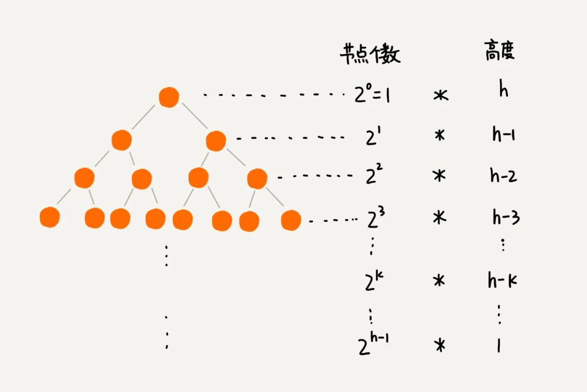

# priority queue

在C++中使用优先队列时，经常会在队列里面填充一个比较复杂的数据结构，而且需要重写排序规则，这种情况下，为要放进去的数据定义一个结构体，并且在结构体里面重载"<"操作符是一个比较简单的做法。其他方便的做法还有定义lambda表达式、定义函数和定义函数对象等。**重载操作符要求至少一个参数为class或者枚举类型**。

## 函数对象

```C++
// 一个函数对象的例子，直接将这个函数对象传递给priority_queue即可
struct cmp{
    bool operator()(ListNode *a, ListNode *b) {
        return a->val > b->val;
    }
};
```

## lambda的使用方式

```C++
    auto cmp = [](ListNode* p1, ListNode* p2) {return p1->val > p2->val; };
    priority_queue<ListNode*, vector<ListNode*>, decltype(cmp)> que(cmp);
```

## 优先队列

优先队列可以使用二叉堆来实现，二叉堆的定义(以大顶堆为例)如下：

1. 堆是一个完全二叉树。完全二叉树存储在数组中时，对于完全二叉树来说，下标从 n/2​+1 到 n 的节点都是叶子节点(下标从1开始)，对于数组存储的完全二叉树来说可以利用「结点i的左右孩子分别为2*i和2*i+1」这个结论和反证法证明。
2. 堆中的每一个节点的值都必须大于等于其子树中每个结点的值。换一种说法，堆中每个节点的值都大于等于（或者小于等于）其左右子节点的值。

优先队列建堆的两种方式和时间复杂度：

1. 自底向上建堆，这种建堆方法有点像插入排序，假设前面的元素已经形成一个堆。然后向堆的尾部插入一个元素之后，利用swim()操作把该元素放到堆中合适的位置。这种建堆方式的时间复杂度为nlogn，这个可以把每一层结点需要比较的次数和交换的次数加起来，是一个等差等比符合数列，可以使用错位相减法求和算出来总的时间复杂度上限。
2. 自顶向下建堆：对于一个二叉堆而言，数组中的每一个元素都是一个子堆的根结点。如果一个根结点的两个孩子结点都是堆，那么只要对该根结点调用sink()操作，把该根结点放到合适的位置，就能够形成一个以该根结点为根的更大的堆。那么对于一个给定的数组，只要从索引n/2处开始向前不断的应用sink()操作就可以构建一个堆。这种方式的时间复杂度是O(n)。堆排序就使用这种方式。

以上两种方式都可以一个给定的数组上原地建堆。

## 堆排序

堆排序是一种原地排序算法，时间复杂度为O(nlogn)，不是一个稳定的排序算法。堆排序采用了自顶向下的建堆方式。对一个数组排序分为两步(以非递减排序为例)，首先在原数组上面建大顶堆，然后不断的删掉堆上最大的元素，放到数组的末尾，直到堆中的元素数量为0。

堆排序比快速排序慢是因为在堆排序中总是会跳着访问数组，相比于快速排序，这并不是缓存友好的一种方式；另外在堆排序算法的排序过程中，元素交换的次数比快排多。因此快速排序更快一点，归并排序应该也是因为这两个原因比快速排序慢。

## 堆时间复杂度计算

堆上操作的时间复杂度的计算可以借助下图理解和计算：


