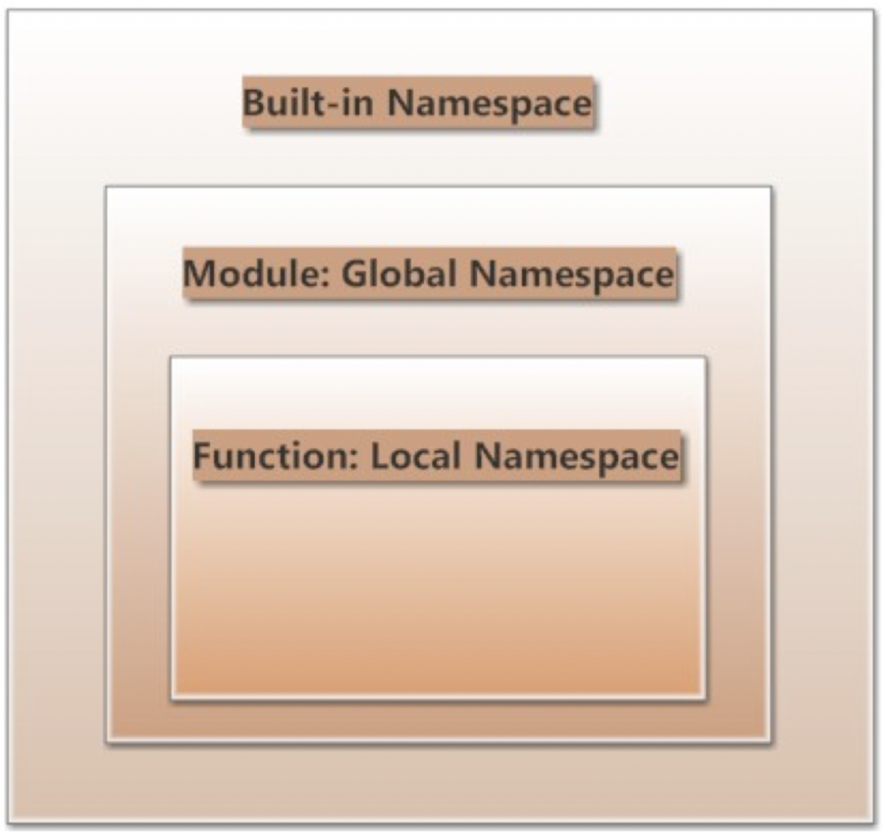

# Python

## python整数表示

尽管python同其他语言一样使用补码来表示整数，但是python中整数没有位数的概念。python整数具有无限扩容机制，那么可以理解为除了表示数字本身的位数之外，其他的高位全部为符号位，也就是高位有无限个1或者无限个0。这也是为什么可以使用0xffffffff获得一个「32位」整数的python补码表示的原因。(补码是人为定义的一个逻辑自洽的系统，使用补码的方式刚好可以把计算机中的加减法运算统一起来。在补码这个系统中，正负数的加法可以统一起来，而减法可以通过先对减数求补再做加法来实现。把n位有符号数表示为补码形式之后，「计算这两个数的加法时，不需要考虑这两个数的原始信息，只需要在补码的基础上直接对两个数做加法，得到和的补码表示形式」。)

## python变量

python中变量与对象的关系可以理解为：变量就是在对象上贴了一个标签。
[可变对象与不可变对象](https://www.runoob.com/note/46684)

对于可变对象存在浅拷贝和深拷贝的区别。以列表为例：切片和copy方法都是浅拷贝，只有copy.ddepcopy方法是深拷贝。b对列表a浅拷贝之后，a和b仍然引用相同的可变对象。

```python
# python中一些变量赋值方式
t = 1, "abc", [1,2,3]  # 把三个变量打包成为一个元组再赋值给t
a, b, c = 1, 2, "valiable" # 同时对多个变量一一对应赋值，go语言也可以这样干
a, b = b, a # 交换两个变量值，比C等其他语言简洁的多

```

## 列表

1. 可以使用 [0, [1,2]] * 5 这样的方式把一个列表扩展变长，把原列表中的元素复制5遍形成一个新的列表
2. 在python2里面，range是一个函数;然而在python3里面，range是一个类，它会根据给定的参数实例化出来一个range对象。
3. python中，一个对象是unhashable是指其可变，能够原地修改，例如list/dict就是不可哈希的；像str这样不可变对象，不能原地修改，就是hashable。dict的键要求是hashable，一般set中的元素也要求是hashable。

## 元组

用圆括号扩起来的数据，可以看做是一个不可变的列表。python中赋值语句或者return语句后使用逗号隔开的元素都会被解析成为一个元组。

## 类

python中，在一个类确定或者是实例化之后，还可以通过使用类或者实例的点号操作object.attribute实现对类属性或者实例属性的修改和增加；类属性不受实例属性的影响。

```python
class A:
    x = [1, 2, 3]

foo = A

A.y = "hello" # 增加一个A的类属性

foo.z = "python" # 给实例foo增加一个实例属性，类不会收纳这个属性
```

## 命名空间



python中分为以下几种命名空间：

- 内置命名空间：Python 运行起来,它们就存在了。内置函数的命名空间都属于内置命名空间,所以,我们可以在任何程序中直接运行它们,比如前面的 id(),不需要做什么操作,拿过来就直接使用了。

- 全局命名空间：每个模块创建它自己所拥有的全局命名空间,不同模块的全局命名空间彼此独立,不同模块中相同名称的命名空间,也会因为模块的不同而不相互干扰。

- 本地命名空间：模块中有函数或者类,每个函数或者类所定义的命名空间就是本地命名空间。如果函数返回了结果或者抛出异常,则本地命名空间也结束了。

那么程序在查询上述三种命名空间的时候,就按照从里到外的顺序,即:Local Namespaces --> Global Na messpaces --> Built-in Namesspaces

作用域是指Python程序可以直接访问到的命名空间。“直接访问”在这里意味着访问命名空间中的命名时无需加入附加的修饰符。程序也是按照搜索命名空间的顺序，搜索相应空间的能够访问到的作用域。

要注意的是，python中没有类似于C\C++那样的for之类的块作用域，在for循环里面定义的变量在for循环外部也可以使用

## 文件

在python中，文件也是可迭代对象(文件是天然的可迭代对象，不需要使用iter()转换就可以直接用next()迭代)，也就是可以使用for循环来读取其中的内容：

```python

# 把打开的文件赋值给变量f，也即变量f跟文件对象file绑定起来(对象引用)，本质上跟其他类型
# 数据进行赋值是一样的（例如：int，class等）

f = open("file", "r") # open默认是用读的方式打开文件
for line in f:
    print line

```

在类Unix系统中，文件都是用二进制模式进行操作的，不存在文本模式和二进制模式两种情况。

## 迭代

就是指按照某种顺序逐个访问列表中的每一项。

## 函数也是对象

在python中，函数也是对象，就像其他常见的变量对象一样，比如str、dict等。当定义一个函数时，函数的名字也是一个变量，它像一个标签一样贴在这个函数上，函数定义作为一个存在于内存中某处的对象，变量名应该引用的也是它的入口地址。Python中比较tricky的是可以在一个函数里面定义函数，并且返回值可以是一个函数，这一点C++和Go中应该都有。

## 模块

模块本质上就是一个扩展名为.py的Python程序。
sys.path里面任何目录下的模块都可以直接import。
__init__.py 是一个空文件,将它放在某个目录中,就可以将该目录中的其它 .py 文件作为模块被引用

## python导入时和运行时

运行时：即通过命令行方式执行Python脚本。
导入时：将代码从一个文件首次导入到另一个文件中。
