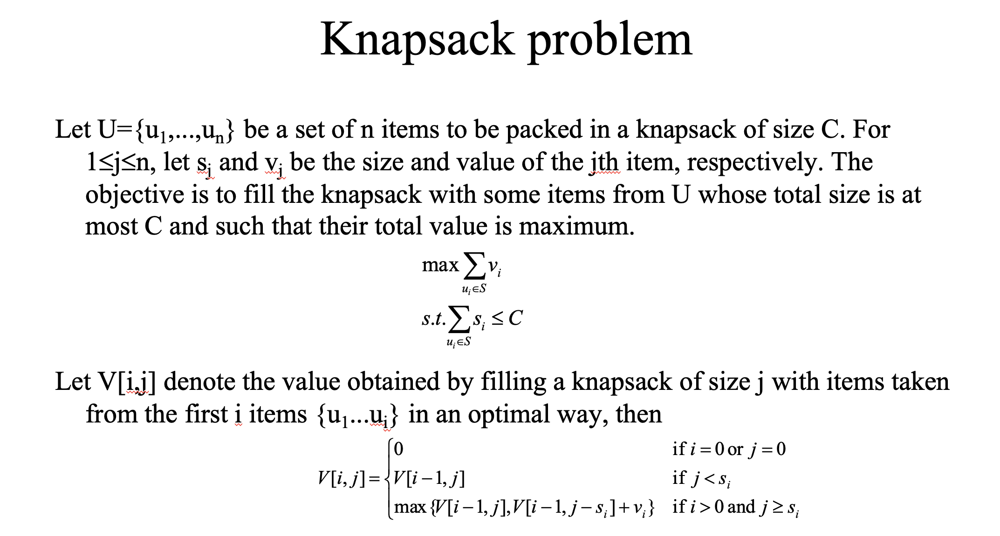
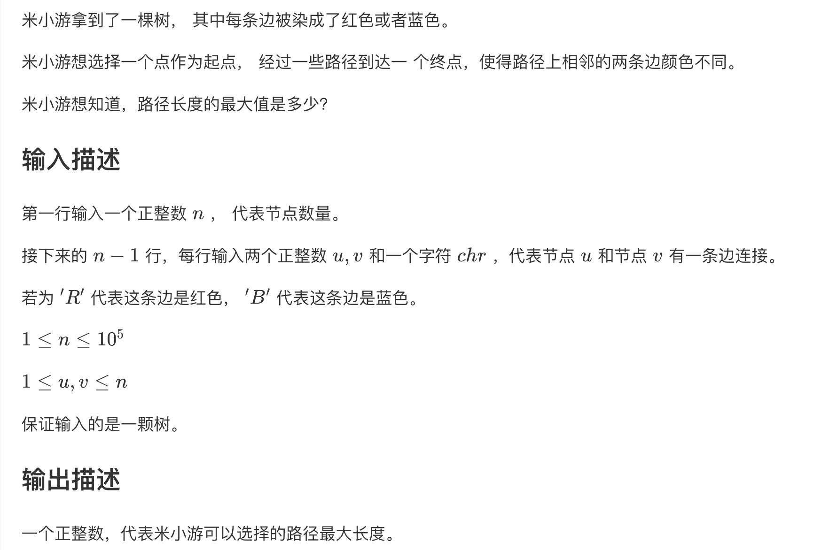

# 动态规划

动态规划适合解决具有[重叠子问题]性质的问题，一般来讲能用动态规划求解的问题都可以使用暴力搜索等方法求解，可以使用动态规划中的DPtable记住一些状态，进而把时间复杂度从指数级别降低到N^2级别。使用动态规划，通过使用DPtable记录已经求解过的子问题的解，每一个子问题只会被计算一次。

最优子结构性质：一个问题的最优解包含子问题的最优解。举例来说，若一个问题P的最优解为S，那么S的子集Sk也是P的某个子问题Pk的最优解。如果确定一道题目要用动态规划来解决，可以设定一个最优解，然后分析它与可能的子问题之间的关系，进而得到状态转移方程。

动态规划中最优子结构就是状态转移方程。解决动态规划的题目可以先从回溯，dfs等暴力算法入手，然后再用dpTable，然后再推导出状态转移方程来用DP。很多比较难的题目直接去想状态转移方程可能想破头都想不出来。

状态 -> base case -> 状态转移方程；这个过程很像数学归纳法，动态规划的状态转移方程很多都类似第一数学归纳法和第二数学归纳法。

二维动态规划，dp\[i\][j]和其他状态之间的关系就从i和j的关系思考

动态规划中，经常使用状态压缩的方法，把二维数组变成一维数组来节约空间，在此过程中，需要注意的是：动态规划的遍历顺序是否需要改变

**动态规划题目提示标签：** 最值(动态规划方法常常用来求解最值问题)

## 经典动态规划问题

### 编辑距离

1. [labuladong详解](https://labuladong.gitee.io/algo/3/25/78/)
2. [力扣题解，下面某评论解释的挺好](https://leetcode-cn.com/problems/edit-distance/solution/bian-ji-ju-chi-by-leetcode-solution/)

### 0-1背包问题



在0-1背包问题中，推导状态转移方程，关键点是看第i个物品是否可以被放进背包里面，假设第i个物品的重量大于j，那么其不能被放置到背包里面，那么V[i,j]就退化为V[i-1, j]。如果第i个物品可以放进背包里面，那么就需要在放第i个物品和不放第i个物品之间做一个比较。

[知乎上解释背包的一篇博客](https://zhuanlan.zhihu.com/p/30959069)

### 树形DP



#### 代码解答

这道题目也可以使用暴力法求解，使用图数据结构只是为了在ACM模式下方便表示，在真正做遍历的时候对图做树形式的DFS遍历，方法是确保不访问父结点即可。暴力法使用这种方式也会比较简单，不用当作图去遍历，每次选择的都是一条可能路径中的拐点。

这道题目如果是力扣形式，使用后续遍历的递归即可。

```C++
#include <bits/stdc++.h>

using i64 = long long;

int main() {
    std::ios::sync_with_stdio(0);
    std::cin.tie(0);
    std::cout.tie(0);

    int n;
    std::cin >> n;
    // 临接表存储
    std::vector adj(n, std::vector<std::pair<int, int>>());
    // dp[i][0]表示以结点i结尾（或开始）且邻边为blue的最长路径
  	// dp[i][0]表示以结点i结尾（或开始）且邻边为red的最长路径
  	std::vector dp(n, std::array<int, 2>{});
    for (int i = 0; i < n - 1; i++) {
    	int a, b;
    	char c;
    	std::cin >> a >> b >> c;
    	a--, b--;
    	int t = (c == 'R');
    	adj[a].push_back({b, t});
    	adj[b].push_back({a, t});
    }
  	/*
  		这道题比较简单的地方在于图是一个无环的连通图，所以从任意结点开始向其他结点看去，都是一个树。
  		所以对树做DFS即可，
  	 */
    // fa是x的父结点
    auto dfs = [&](auto self, int x, int fa) -> void {
    	// 叶子结点对应的值为0
      for (auto [y, w] : adj[x]) {
    		// 尽管使用图的结构表示，但实际上是在DFS一棵树，所以不访问父结点
        if (y == fa) continue;
    		self(self, y, x);
        
    		dp[x][w] = std::max(dp[x][w], dp[y][!w] + 1);
    	}
    };

    dfs(dfs, 0, -1);

    int ans = 0;
    for (int i = 0; i < n; i++) {
      // dp[i][0] + dp[i][1]一定是经过顶点i的最长的那一条符合条件的路径
      // 使用反证法证明，若其不是，那么dp[i][0]和dp[i][1]至少有一个不是最优解
      // 因为符合条件的路径一定经过图中某一结点，所以这个for循环一定会列出最优解
    	ans = std::max(ans, dp[i][0] + dp[i][1]);
    }
  	
    std::cout << ans << "\n";
    
    return 0;
}
```
