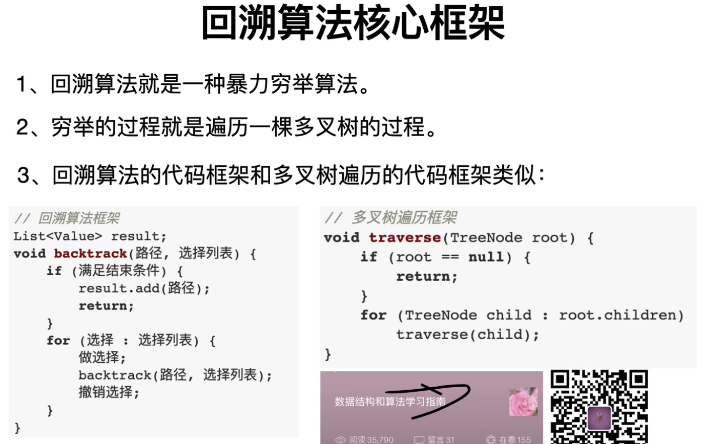

# 回溯

本质上讲，回溯算法就是在遍历一棵**决策树**。所以针对具体问题，首先构造出其对应的决策树，画出决策树之后，回溯问题就变成了如何遍历这颗决策树，而遍历决策树就同DFS一样。

不论是子集问题还是排列问题，去重都是通过在决策树的同一层不选择重复结点，而在决策树的不同层之间可以选择重复结点来实现的。

## 子集问题决策树

可以认为每一个节点上存储着到达当前节点的路径和当前节点可以做的选择。子集问题中所有的结点全部都存储着一个可行的解。

1. 决策树第n层是全部包含n个元素的子集。


### 子集问题代码解析

```C++
// 无重复集合求解子集
// 要注意的一个点是[]也是某个集合的一个子集
// 对于有重复元素的情况，需要排序之后在同一层去重
// 子集问题中判断相同元素在同一层的方法是：对原始数组排序后，直接判断即可，不需要标记数组，因为子集问题中
// 站在当前某个结点上，可以做的选择全部选择都是给定索引之后的，因此i和索引k比较大小就可以判断是否在同一层
class Solution {
public:
  	// cur表示站在当前结点上，只能从cur开始向后做选择
  	// cur其实就是数组的索引
    void backtrace(vector<int>& nums,int cur) {
      	// 子集问题不需要在此处判断是否退出，下面的for循环保证了一定会在某点退出
      
      	// 每次进入时，就在决策树的某一个结点上，那么这个结点一定是存储了一个路径
      	// 尽管对于根结点来说，其存储了一个空列表，但其也是子集的一个解
        res.push_back(track);
				// 在当前这一层，可以选择值的范围[cur, nums.size())，
        // 不能向前选择，会出现重复。
        for(int i = cur; i < nums.size(); i++) {
          	// 在有重复元素时，二叉树的剪枝逻辑如下：
          	// i > cur保证了是在做同层剪枝，而不是相邻层之间的剪枝
           	// if (i > cur && nums[i] == nums[i - 1]) { 
            //     continue;
            // }
            track.push_back(nums[i]);
            backtrace(nums, i+1);
            track.pop_back();
        }
    }

    vector<vector<int>> subsets(vector<int>& nums) {
        backtrace(nums, 0);
        return res;
    }

private:
    // 存储最终结果
    vector<vector<int>> res;
    // 存储某条路径上的结果
  	vector<int> track;
};
```


## 排列问题决策树

可以认为每一个节点上存储着到达当前节点的路径和当前节点可以做的选择。排列问题的结束条件是到达叶子结点，因为在叶子结点上选择列表为空。


### 排列问题代码示例

```C++
// 在排列问题中
// k represent kth layer ?
// k确实表示层数，同时k也可以表示对于一个长度为n的排列，前k-1个数都已经确定，在剩下的数字里面选择一个去填充
// 第k个元素
void permute_recursion(vector<int> &nums, int k) {
    // DFS中的终止条件
    // 对于排列问题而言，这个条件相当于遍历到了决策树的叶子结点
    // 遍历到了叶子结点，一定拿到了一个解，返回这个解即可
    if(k >= nums.size()) {
        res.push_back(path);
        return;
    }

    // 对决策树做DFS，每一次选择一条边做递归
    for(int i = 0; i < nums.size(); i++) {
        if(!isUsed[i]) {
          	// 做选择
            path.emplace_back(nums[i]);
            isUsed[i] = true;
            permute_recursion(nums, k+1);
            // 撤销选择
            path.pop_back();
            isUsed[i] = false;
        }
    }
}


// k represent kth layer ?
void permute_recursion(vector<int> &nums, int k) {
    // DFS中的终止条件
    // 对于排列问题而言，这个条件相当于遍历到了决策树的叶子结点
    // 遍历到了叶子结点，一定拿到了一个解，返回这个解即可
    if(k >= nums.size()) {
        res.push_back(path);
        return;
    }

    // 对决策树做DFS，每一次选择一条边做递归
    for(int i = 0; i < nums.size(); i++) {
        if(!isUsed[i]) {
          	// 排列问题有重复元素如何剪枝？？？
            // 必须确保在同一层去重，那么与前一个元素相同，并且前一个元素未使用都要满足
            // 前一个元素没有被使用是其和当前元素在同一层的前提条件
            if(i > 0 && nums[i] == nums[i-1] && !isUsed[i-1])
                continue;
            path.emplace_back(nums[i]);
            isUsed[i] = true;
            permute_recursion(nums, k+1);
            path.pop_back();
            isUsed[i] = false;
        }
    }
}
```

### 同层剪枝 VS 非同层剪枝

相信你现在已经知道如下条件的作用了，很多人对最后一个子条件比较疑惑。即采用`!visited[i - 1]` 或 `visited[i - 1]`，结果竟然是一样的，不光都是对的，而且输出也是一摸一样。

```lisp
if(visited[i] || (i > 0 && nums[i - 1] == nums[i] && !visited[i - 1])) continue;
```

实际上如果你愿意付出点时间用纸笔跟踪一下递归过程，你会发现 `!visited[i - 1]` 实现了 「同层剪枝」，而 `visited[i - 1]` 实现「非同层剪枝」。

【同层剪枝】

当选取到nums[i]，并满足 `i > 0 && nums[i - 1] == nums[i]` 时，若 `!visited[i - 1] = true`，说明以nums[i - 1]为某一层元素的选择已穷尽，以至于在回溯的时候置 visited[i - 1] = false）。于是后续会根据这个条件跳过同层相等元素。

【非同层剪枝】

最后一个子条件若采用 `visited[i - 1]`，当选取到nums[i]，并满足 `i > 0 && nums[i - 1] == nums[i]` 时，若 `visited[i - 1] = true`，表明当前是在nums[i - 1]的子树中选择nums[i]，根据这个条件，在子树中遇到nums[i]，总是不选取（continue），那么该子树总是无法提供有效排列（因为缺少nums[i]），于是对该子树的搜索都是无效的。之后回溯到nums[i - 1]所在层后，由于撤销为 visited[i - 1] = false，不再满足visited[i - 1] = true，于是不会跳过，可以正常选取到包含nums[i - 1]和nums[i]的排列。

通过上述说明，采用`!visited[i - 1]`的「同层剪枝」效率更高，因为「非同层剪枝」对nums[i - 1]的子树（存在nums[i] == nums[i - 1]）的搜索是无效的。另外我们也可以看到，无论哪一种，输出有效排列的顺序是一致的。二者的差别可理解为，非同层剪枝比同层剪枝多做了无效子树搜索动作。

## 回溯模版

回溯的模版如下，在用如下框架解决问题时，依据决策树来思考，抛弃掉原问题，只需要思考如何遍历树：
